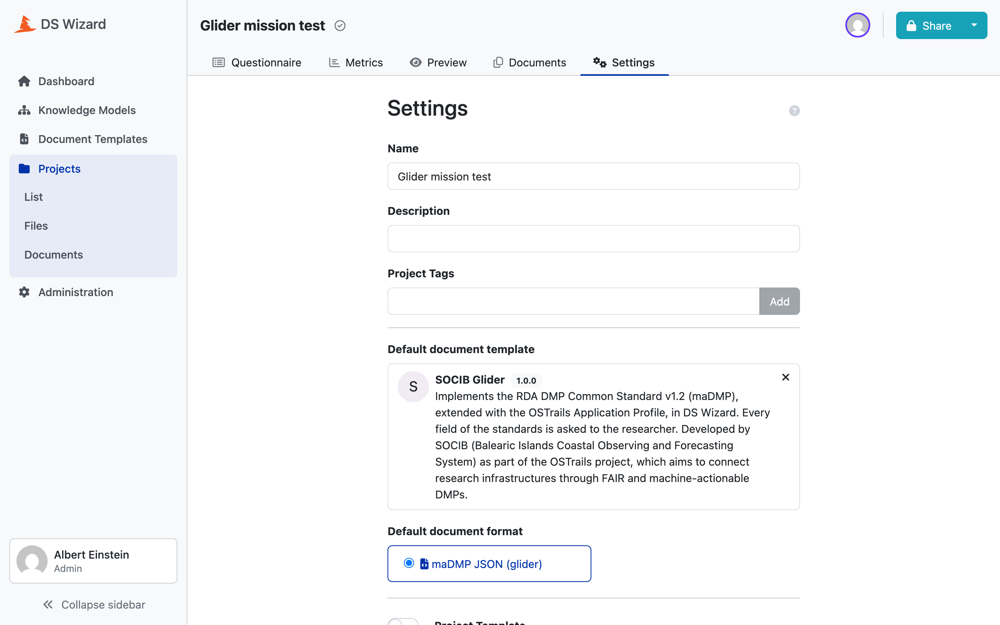

# An end-to-end run

From nothing to a DMP committed in the registry, with its verdict. Every
command below was run, in this order, and every output is the real one.

Roughly fifteen minutes, most of it waiting for CI.

## 0. Starting from nothing

```bash
docker compose --profile tools down -v --remove-orphans
```

`-v` is the important flag: it destroys `db-data` and `s3-data`, so DSW starts
with an empty database and empty object storage. Without it you are testing an
upgrade, not a first run.

If you are also resetting the published artifacts, the registry has to go back
to its scaffolding, or the submission will show as an update rather than a
creation:

```bash
git rm projects/glider/template/dmp_glider_template.*.json projects/glider/template/dmp_glider_template.json
```

## 1. Publish the webhook image

The stack pulls `ghcr.io/pstcricq/ostrails-madmp-core/submission:<tag>`, so
that tag has to exist before the stack comes up.

```bash
git -C madmp-core tag -a v1.0.0 -m "First complete version"
```

```bash
git -C madmp-core push origin v1.0.0
```

The tag runs the whole workflow. On this run: nine jobs green, and two skipped
for reasons that are both correct.

```
configs: success        registry-sync: skipped
registry: success       publish: skipped
image: success          release: success
projects: success       version: success
generate: success       checks: success        rules: success
```

`registry-sync` is skipped because its condition is
`github.ref == 'refs/heads/main'` and this is a tag. `publish` is skipped
because `vars.DSW_API_URL` is unset, and a GitHub runner could not reach a
stack bound to `127.0.0.1` anyway.

Confirm the image is really there before going further:

```bash
docker manifest inspect ghcr.io/pstcricq/ostrails-madmp-core/submission:v1.0.0
```

## 2. Bring the stack up

```bash
bash madmp-dsw/scripts/setup.sh
```

Six containers, four of them with a healthcheck, plus the bucket. The script
returns only once every healthcheck passes.

Check each floor rather than trusting the script:

```bash
docker ps --format "{{.Names}}\t{{.Status}}"
```

```bash
curl -s -o /dev/null -w "%{http_code}\n" -X POST http://127.0.0.1:3000/wizard-api/tokens \
  -H 'Content-Type: application/json' \
  -d '{"email":"albert.einstein@example.com","password":"password"}'
```

`201` means the API answers and the seeded accounts are there.

```bash
docker exec madmp-dsw-submission-1 python -c "import urllib.request; print(urllib.request.urlopen('http://localhost:8080/health').read().decode())"
```

## 3. Generate and publish

```bash
rm -rf madmp-core/build
```

```bash
cd madmp-core && uv run python scripts/validate_generation.py
```

Then publish, which needs the environment loaded because nothing reads `.env`
by itself:

```bash
cd madmp-core && set -a && . ./.env && set +a && uv run python -m dsw.publish all configs/projects/glider.yaml
```

`all` runs `km`, then `template`, then `submission`, and the order is
load-bearing.

Verify from the API rather than from the screen:

```bash
curl -s "$DSW_API_URL/knowledge-model-packages" -H "Authorization: Bearer $TOK" | python3 -m json.tool
```

## 4. Create the project

```bash
curl -s -X POST "$DSW_API_URL/projects" \
  -H "Authorization: Bearer $TOK" -H 'Content-Type: application/json' -d '{
  "name": "Glider mission test",
  "knowledgeModelPackageUuid": "<the KM uuid>",
  "documentTemplateUuid": "<the template uuid>",
  "formatUuid": "<the format uuid>",
  "visibility": "PrivateProjectVisibility",
  "sharing": "RestrictedProjectSharing",
  "questionTagUuids": []
}'
```

!!! warning "GET /projects/{uuid} does not show the document template"
    It comes back without `documentTemplate` or `formatUuid`, which reads
    exactly like a creation that did not take. Read `/projects/{uuid}/settings`
    instead, which shows both.



## 5. Answer the questionnaire

In the interface, or through the API. A reply is a `SetReplyEvent` whose `path`
composes the entities of [the UUID convention](../core/05-uuids.md):

```
<chapterUuid>.<questionUuid>
<chapterUuid>.<listQuestionUuid>.<itemUuid>.<childQuestionUuid>
```

```bash
curl -s -X PUT "$DSW_API_URL/projects/<uuid>/content" \
  -H "Authorization: Bearer $TOK" -H 'Content-Type: application/json' -d '{
  "events": [
    {"type": "SetReplyEvent", "uuid": "<a fresh uuid4>",
     "path": "742e6d6f-...-18a54db3b4f8.a378983e-...-a0b50727b377",
     "value": {"type": "StringReply", "value": "Glider observations along the Canales line"}}
  ]
}'
```

The reply value types are `StringReply`, `AnswerReply` (an answer uuid),
`ItemListReply` (a list of item uuids), and `MultiChoiceReply`.

### The minimum that passes

Seventeen replies. Anything less fails the quality control, and anything more
drags in its own required children: adding one affiliation demands an
`affiliation_id.identifier`, a `type` and a `name`.

| Field | Value |
|---|---|
| `dmp.title` | Glider observations along the Canales line |
| `dmp.language` | `eng` |
| `dmp.ethical_issues_exist` | `no` |
| `dmp.description` | End-to-end test plan for the SOCIB glider pilot. |
| `dmp.version` | 1.0.0 |
| `dmp.contact.mbox` | data.centre@socib.es |
| `dmp.contact.name` | SOCIB Data Centre |
| `dmp.contact.contact_id[0]` | `0000-0002-1825-0097`, type `orcid` |
| `dmp.dataset[0].dataset_id` | `10.25704/glider-canales-e2e`, type `doi` |
| `dmp.dataset[0].title` | CTD profiles, Canales line |
| `dmp.dataset[0].description` | Temperature and salinity profiles from a glider mission. |
| `dmp.dataset[0].personal_data` | `no` |
| `dmp.dataset[0].sensitive_data` | `no` |

`dmp.created` and `dmp.modified` are not on that list: they are computed from
the DSW project's own dates. Neither is `dmp_id`, which the template fills and
the webhook rewrites.


## 6. Check the verdict before submitting

Render the document without persisting a submission, then judge it locally:

```bash
curl -s "$DSW_API_URL/projects/<uuid>/documents/preview" -H "Authorization: Bearer $TOK"
```

It answers `202` while the worker renders, then `200` with a presigned URL.

!!! warning "That URL is signed for host.docker.internal"
    Changing the host breaks the signature, because `X-Amz-SignedHeaders=host`.
    Keep the Host header and redirect the connection instead:

    ```bash
    curl --resolve host.docker.internal:9000:127.0.0.1 "$URL" -o dmp.json
    ```

```bash
cd madmp-core && uv run python -m quality_control.run --pins configs/projects/glider.yaml --dmp dmp.json
```

```
dmp.json: 106 checks against rda_dcs + ostrails, 0 fail, 0 warning,
30 missing, 76 pass -> PASS
```

## 7. Submit

In the interface: **Documents**, then the submission service named
`SOCIB Glider → ostrails-madmp-registry/glider`.


A refusal comes back as plain text with the violations spelled out, and nothing
is written. A pass commits three files.

## 8. Verify the far end

Do not take DSW's word for it. Look at the registry:

```bash
gh api "repos/pstcricq/ostrails-madmp-registry/git/trees/main?recursive=1" --jq '.tree[] | select(.type=="blob") | .path'
```

```
projects/glider/template/dmp_glider_template.check.json
projects/glider/template/dmp_glider_template.json
projects/glider/template/dmp_glider_template.meta.json
```

The commit reads `Add DMP for glider (DSW submission)`. `Add` and not `Update`
is what says the registry really was empty.

Then close the loop on the identifier, which is the one claim the pipeline
makes about the outside world:

```bash
curl https://raw.githubusercontent.com/pstcricq/ostrails-madmp-registry/main/projects/glider/template/dmp_glider_template.json
```

It should return the committed document byte for byte. And the verdict beside
it should read:

```json
{ "verdict": "pass", "engine": "1.0.0",
  "summary": { "total": 106, "fail": 0, "warning": 0, "missing": 30, "pass": 76 } }
```

`engine` naming the release you tagged in step 1 is the last thing to check:
it is what ties the plan in the registry to the code that judged it.

## The API in short

| Want | Endpoint |
|---|---|
| a token | `POST /tokens` |
| the full API | `GET /wizard-api/swagger.json` |
| Knowledge Models | `GET /knowledge-model-packages` |
| document templates | `GET /document-templates`, `/document-templates/{uuid}` |
| projects | `GET POST /projects` |
| a project's template and format | `GET /projects/{uuid}/settings` |
| replies | `PUT /projects/{uuid}/content` |
| render without submitting | `GET /projects/{uuid}/documents/preview` |
| the submission services | `GET PUT /tenants/current/config` |

!!! note "It is /projects, not /questionnaires"
    The client route is `/wizard/projects/{uuid}`, and so is the API's. The
    swagger document at `/wizard-api/swagger.json` is the authority, and it is
    served without authentication.
