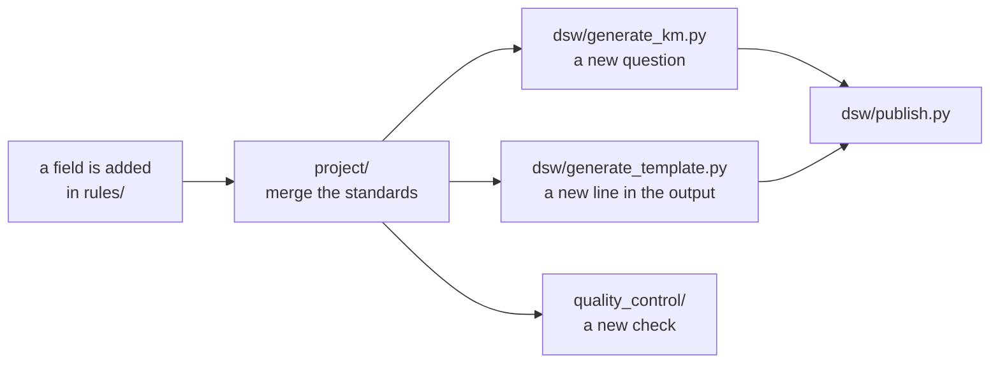

# madmp-core: overview

Everything that decides anything lives here. The rules that say what a DMP may
contain, the generators that turn them into the two packages DS Wizard
consumes, the quality control that judges a submitted plan, and the webhook
that receives one.

## The packages

Nine, plus the tests. Each one is a directory at the root, and the order below
is the order a change travels through them.

| Package | What it holds | Page |
|---|---|---|
| `rules/` | The meta-schema, and the standards written against it. | [2](02-rules.md) |
| `configs/` | One file per project: which standards, which versions. | [3](03-configs.md) |
| `project/` | Merging the standards into a single model. | [4](04-project.md) |
| `dsw/` | The UUID convention, the two generators, and publishing. | [5](05-uuids.md), [6](06-knowledge-model.md), [7](07-document-template.md), [8](08-publish.md) |
| `quality_control/` | Checking one DMP against the merged model. | [9](09-quality-control.md) |
| `submission/` | The webhook DS Wizard posts a finished document to. | [10](10-submission.md) |
| `registry/` | Laying out a project's folder in the registry. | [11](11-registry.md) |
| `scripts/` | The validators CI runs, one per kind of data. | [11](11-registry.md), [12](12-engineering.md) |
| `utils/` | Schema validation, error reporting, the GitHub client. | [12](12-engineering.md) |
| `tests/` | One module per module. | [12](12-engineering.md) |

One `uv sync` at the root installs the lot as a single environment, so every
package imports every other without path juggling. The lockfile is committed,
so the versions are decided in the repository and not resolved at install time.

## What a change travels through

A rules file is edited. Nothing about that edit names a chapter, a question, a
UUID or a Jinja expression: those are all derived.



The same merged model feeds the questionnaire, the document template and the
quality control. A field cannot be asked without being renderable, and cannot
be rendered without being checked, because none of the three has its own list
of fields.

## What it produces

Two packages, and one image.

- a **Knowledge Model bundle**, the questionnaire itself, published into a DSW
  instance
- a **Document Template bundle**, which turns answers into a maDMP JSON
  document
- the **submission webhook image**, `ghcr.io/pstcricq/ostrails-madmp-core/submission`,
  which a deployment pulls and runs

Both bundles are built under `build/`, which is not versioned. What is
versioned is what they are built from.

## Running it locally

```bash
uv sync
uv run python scripts/validate_generation.py
```

That builds every project's KM and document template under `build/`, touching
neither DS Wizard nor the registry. It is also the job CI runs to say that
every project in the repository can be generated, not just the one the tests
cover in depth.

Publishing needs an instance and an account, and reads both from the
environment with no defaults:

```bash
export DSW_API_URL=http://localhost:3000/wizard-api
export DSW_EMAIL=you@example.com DSW_PASSWORD=...
uv run python -m dsw.publish all configs/projects/glider.yaml
```

## The one rule the layout follows

**A package holds either data or the code that reads it, never both for two
different kinds of data.** `rules/` holds the meta-schema and the standards.
`configs/` holds the config schema and the project files. Neither knows what
DS Wizard is. `dsw/` knows what DS Wizard is and nothing about how a rules file
is spelled.

That is what makes the model the only interface between the two halves, and
the reason a DSW upgrade touches `dsw/` alone.
