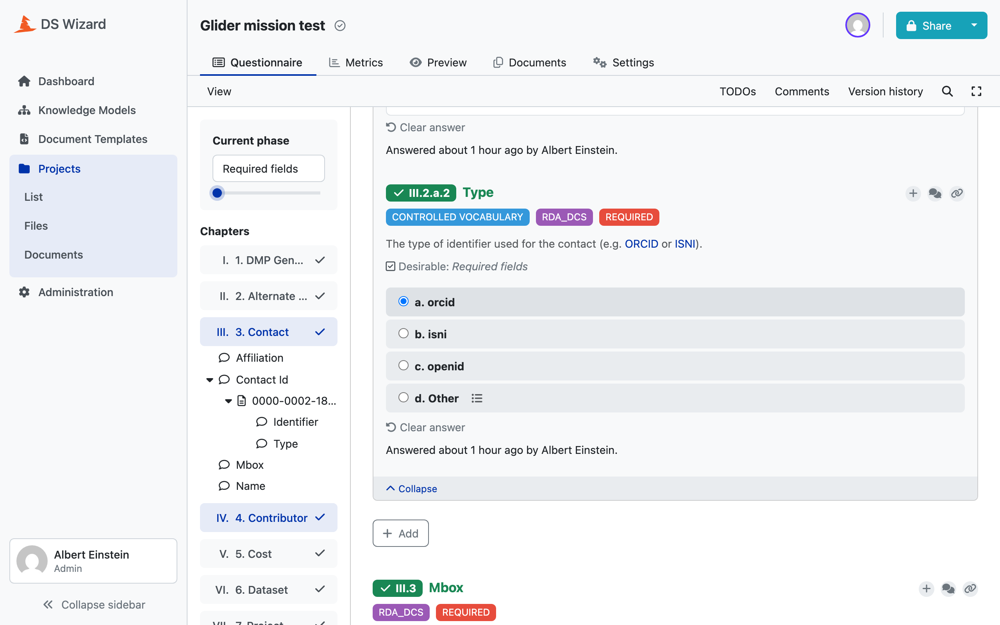

# rules/ : the standards

A rules file declares what a DMP may contain. It is data, not code: a JSON
document validated against a meta-schema, `rules/rules.schema.json`, which is
the only place the format of a rules file is written down.

```
rules/
├── rules.schema.json          the format of a rules file
├── loader.py                  loading one, and everything that can be wrong
└── standards/
    ├── rda_dcs/1.0.0.json     the base standard, 1008 lines
    └── ostrails/1.0.0.json    an extension, 111 lines
```

## The shape of a file

Four required keys, then a recursive tree of fields.

```json
{
  "standard": "ostrails",
  "version": "1.0.0",
  "extends": true,
  "dmp": {
    "data_access": {
      "_cardinality": "0..1",
      "_type": "string",
      "_allowed_values": ["open", "closed", "shared"],
      "_description": "The overall access level for this DMP's data."
    }
  }
}
```

Every key under `dmp` is a field. Every key inside a field that does not start
with an underscore is a child field. Everything that does start with one is
metadata about the field itself. That is the entire grammar, and it is why the
tree nests to any depth without the schema growing.

## Two orthogonal facts per field

This is the part worth reading twice, because everything downstream is built
on it.

`_cardinality` says **how many**, `_type` says **what each one is**.

| `_cardinality` | Meaning | JSON shape |
|---|---|---|
| `1` | exactly one, required | a single value |
| `0..1` | at most one, optional | a single value |
| `1..n` | at least one, required | an array |
| `0..n` | any number, optional | an array |

**There is no `list` type.** A field holds an array when its cardinality ends
in `n`, and never because of its type. The two questions stay separate, so
`1..n` of `object` and `1..n` of `string` are the same statement about number
and a different statement about content.

`_type` is one of eleven: `object` for a structured entity with children, or
one of ten scalar formats.

```
string  number  boolean  date  datetime  email  url  currency
country_code  language
```

An `object` is the only type that may have children, and it must have at least
one.

## Vocabularies, closed or recommended

A scalar field may carry one vocabulary, never two.

| Key | A value outside it is | Becomes, in the quality control |
|---|---|---|
| `_allowed_values` | a violation of the standard | `fail` |
| `_suggested_values` | worth flagging, not wrong | `warning` |

The distinction is not cosmetic. `dmp.ethical_issues_exist` carries
`_allowed_values: ["yes", "no", "unknown"]`, so anything else is a broken
document. `dmp.contact.contact_id[].type` carries
`_suggested_values: ["orcid", "isni", "openid"]`, because an identifier scheme
nobody listed is still an identifier scheme.

That difference is visible in the generated questionnaire: a recommended
vocabulary gets an extra **Other** answer with a free-text follow-up, a closed
one does not.

!!! warning "A vocabulary that already names its own escape gets no second one"
    Several RDA DCS and DataCite vocabularies end in `other` or `Other`
    already. Adding a synthetic escape beside one of those would produce two
    answers with the same identity, because an answer's UUID derives from its
    value. `needs_a_synthetic_escape()` withholds it:

    ```python
    if field.allowed_values is not None:
        return False
    if field.suggested_values is None:
        return False
    return not any(value.lower() == ESCAPE_VALUE for value in field.suggested_values)
    ```



The `CONTROLLED VOCABULARY` tag, the three listed values and the `d. Other`
escape all come from that one `_suggested_values` array.

## Three layers of validation

`load_rules_file()` is the only entry point, and it validates in three layers.
A failing layer reports **every** problem it found, not the first.

**1. Structural**, against `rules.schema.json`: required keys, the closed
`_cardinality` and `_type` enumerations, no unknown metadata keys, snake_case
names.

**2. Coherence**, five constraints a JSON schema cannot express, checked in
`loader.py`:

```python
if field_children(node) and node.get("_type") != "object":
    problems.append(
        f"{path}: declares child fields but has _type "
        f"{node.get('_type')!r}, only 'object' fields may have children."
    )
```

The five: only `object` fields may have children, every `object` field must
have at least one, vocabularies only on scalars, never both vocabularies on one
field, and `_chapter_description` only on a top-level object field.

**3. Layout**: the document must declare the standard and the version its own
path names. A file at `standards/ostrails/1.0.0.json` that says
`"version": "1.0.1"` is refused.

```python
if doc["version"] != path.stem:
    problems.append(
        f"declares version {doc['version']!r} but is named {path.stem!r}, "
        f"the two must agree."
    )
```

!!! note "Why the layers run in order"
    Layers 2 and 3 read `doc["standard"]`, `doc["version"]` and `doc["dmp"]`
    without guarding, because layer 1 has just guaranteed they are there and
    typed. They only run when it found nothing, and then they report together.

## The two standards

`extends` is the only structural difference between them.

**`rda_dcs` 1.0.0** is the base, `"extends": false`. It is the RDA DMP Common
Standard v1.2, the whole of it, 1008 lines. There is exactly one base standard.

**`ostrails` 1.0.0** is an extension, `"extends": true`. It is the OSTrails
Application Profile: it adds fields to entities the base already defines, and
never redefines their cardinality. Structural parents are redeclared with the
**same** cardinality and type as in the base, purely so the tree can be walked
down to the new leaves:

```json
"dataset": {
  "_cardinality": "1..n",
  "_type": "object",
  "documentation":     { "_cardinality": "0..1", "_type": "string", ... },
  "methodology":       { "_cardinality": "0..1", "_type": "string", ... },
  "naming_convention": { "_cardinality": "0..1", "_type": "string", ... },
  "target_audience":   { "_cardinality": "0..1", "_type": "string", ... }
}
```

`dataset` here says nothing new. It is a path to the four fields that are new.
What happens when two standards declare the same field is the subject of
[4. project/](04-project.md), and the answer is narrower than it looks.

## Adding a field

1. Add it to the right standard, at the right place in the tree.
2. Run `uv run python scripts/validate_rules.py`.
3. Regenerate: `uv run python scripts/validate_generation.py`.

There is no fourth step. The question, its UUID, its tags, the line that
renders it and the checks that judge it are all derived from what you just
wrote.
