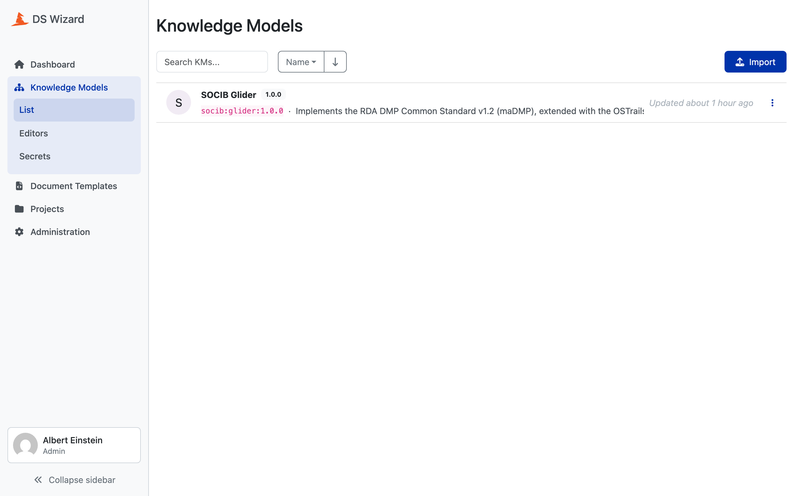

# configs/ : the projects

A project is one YAML file. It declares who the project is, which rules files
it is built from, and what the generated DSW packages carry beyond the rules
themselves.

```
configs/
├── config.schema.json      the format, strict
├── loader.py               loading one, and everything that can be wrong
└── projects/
    └── glider.yaml         one file per project
```

A project changes only when its config is edited and its `version` bumped.
There is no other lever.

## The whole of a config

```yaml
# --- Project: its own facts ---
id: glider
name: "SOCIB Glider"
version: "1.0.0"                 # bump to publish a change
author: "Pierre St-Cricq dit Lompre ([SOCIB](https://www.socib.es))"
license: "CC BY 4.0"

# --- Rules: the exact files this project is built from ---
rules:
  - rda_dcs: "1.0.0"
  - ostrails: "1.0.0"

# --- DSW: what the generated packages carry beyond the project itself ---
organizationId: socib
description: |-
  Implements the **RDA DMP Common Standard v1.2 (maDMP)**, extended with the
  **OSTrails Application Profile**, in [DS Wizard](https://ds-wizard.org).
  ...
references:
  - label: "RDA DMP Common Standard specification"
    url: "https://github.com/RDA-DMP-Common/RDA-DMP-Common-Standard"
auto_timestamps: true
```

Ten keys, **every one required and no extra one allowed**. The schema sets
`additionalProperties: false` and lists all ten in `required`, so a typo in a
key name is a failure and not a silently ignored line.

## The three that DSW constrains

`id`, `version` and `organizationId` are not free text. They become the DSW
package identifier `organizationId:id:version`, one third each, and their
patterns are DSW's own.

| Key | Pattern | Why |
|---|---|---|
| `organizationId` | `^[a-z0-9.]+$` | first third of the identifier |
| `id` | `^[a-z0-9-]{1,64}$` | middle third, DSW's character set for a `kmId` |
| `version` | `^[0-9]+[.][0-9]+[.][0-9]+$` | last third, semver, the form DSW requires |

For the glider project that composes to `socib:glider:1.0.0`, which is what the
Knowledge Model and the document template are both published as.



`name` is the exception in that group: prose, checked against nothing, and
**never derived from `id`**. It is what a reader sees and only that.

## The pins

`rules:` is a list of single-key mappings, base standard first.

```yaml
rules:
  - rda_dcs: "1.0.0"
  - ostrails: "1.0.0"
```

Each entry names exactly one file, `rules/standards/<standard>/<version>.json`.
The schema enforces one key per entry (`minProperties: 1`, `maxProperties: 1`),
snake_case on the key, and a **non-empty string** on the value.

!!! warning "Quote the version"
    Unquoted `1.0` is a YAML float, not a version, and it would reach the
    loader as the number `1.0`. The schema requires a string, so it is caught,
    but the reason the quotes are there is worth knowing before you write the
    next config.

Order matters, and [4. project/](04-project.md) says why: the first pin is the
base standard, the ones after it are extensions applied in the order written.

## Resolving a pin

`project/pins.py` turns declarations into paths and answers one question: are
the files there. It opens nothing and validates no content.

When a pin does not resolve, the error says what the tree does offer, so the
fix does not need a second look at the disk:

```python
problems.append(
    f"standard {name}: unknown version {version!r}, it has "
    f"{_versions_in(directory)}."
)
```

!!! warning "A pin is read from a file and then built into a path"
    A pin part becomes a path component, so `..` or a separator in it would
    reach outside the rules tree. Each half must be one component and nothing
    else:

    ```python
    def _is_one_component(part: str) -> bool:
        return part not in ("", ".", "..") and part == Path(part).name
    ```

    The dot names are listed explicitly because `Path("..").name` is `".."`,
    which the round-trip alone would let through.

## Validation, two layers

Same discipline as the rules loader: each layer reports **every** problem it
found, and the second only runs when the first found nothing.

1. **Structural**, against `config.schema.json`.
2. **Layout**: the filename must equal the declared `id`. A config at
   `projects/glider.yaml` that says `id: gliders` is refused.

An empty file fails the first layer as a non-object, because `yaml.safe_load`
returns `None` for it.

## auto_timestamps

The one key that changes what is generated rather than what it is called.
With `auto_timestamps: true`, the document template fills `dmp.created` and
`dmp.modified` from the DSW project's own dates instead of asking the
researcher for them. The mechanism is in
[7. Generating the document template](07-document-template.md).

## Assembling it all

`assemble_project()` is what every generator calls. It owns no step of its
own, only the order, which is the same for every caller:

```python
config = load_config_file(config_path)
model = merge_rules(resolve_pins(config["rules"], rules_dir))
return Project(config=config, model=model)
```

Read the config, turn its pins into paths that exist, merge the rules behind
them. There is nothing to merge before the pins resolve.

What comes back is a `Project`: the config as declared, and the `Model` its
rules merge into.

## Adding a project

1. Write `configs/projects/<id>.yaml`, the filename matching the declared `id`.
2. `uv run python scripts/validate_configs.py`
3. `uv run python scripts/validate_generation.py`

CI offers every config in `configs/projects/` to every job that acts, so a new
project is generated, registered and published without a list of projects
existing anywhere.
