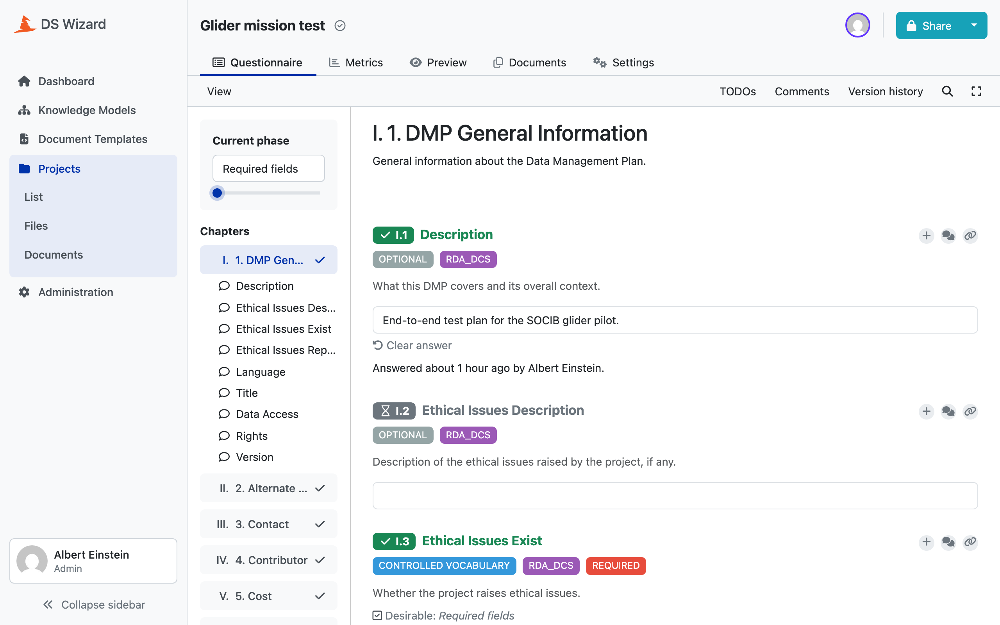
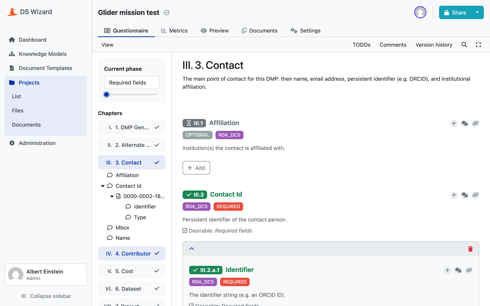

# Generating the Knowledge Model

`dsw/generate_km.py` walks the merged model and emits a DS Wizard Knowledge
Model bundle: the questionnaire itself, as a list of events.

```bash
uv run python scripts/validate_generation.py    # writes build/km/<id>_km.km
```

## A bundle is a list of events

DSW does not take a description of a questionnaire, it takes the events that
would have built one. For `socib:glider:1.0.0` that is **492 events**:

| Event | Count |
|---|---|
| `AddKnowledgeModelEvent` | 1 |
| `AddPhaseEvent` | 1 |
| `AddTagEvent` | 5 |
| `AddChapterEvent` | 9 |
| `AddQuestionEvent` | 171 |
| `AddAnswerEvent` | 265 |
| `AddChoiceEvent` | 40 |

Each event carries its own `entityUuid` and the `parentUuid` it hangs from,
both derived by [the UUID convention](05-uuids.md).

!!! warning "Emission order is reading order"
    DSW infers the order of sibling entities from the order of the events
    sharing a `parentUuid`. The order questions are emitted in **is** the order
    a researcher reads them. Reordering a loop in this module reorders the
    questionnaire.

## The metamodel version is pinned

```python
METAMODEL_VERSION = 20
```

Tied to the DSW instance and not to the project. `knowledgeModelMetamodelVersion`
is 20 in engine-backend at v4.31.0, and `kmp_schema_v20.json` in
[dsw-schemas](https://github.com/ds-wizard/dsw-schemas) is what an event of
this bundle has to look like. Each of those schemas is
`additionalProperties: false`, so **a field the schema does not define is not a
field this generator may send**. Upgrading DSW means checking that number and
that schema first.

## Chapters: a split, not a filter

```python
def top_level_split(model: Model) -> tuple[list[Field], list[Field]]:
    general, chapters = [], []
    for field in model.fields:
        (chapters if field.type == "object" else general).append(field)
    return general, chapters
```

A top-level field earns its own chapter exactly when it is an object, single or
list. Every top-level scalar joins one shared general chapter. Nothing is
dropped: `dmp.title`, `dmp.language` and `dmp.version` are scalars and end up
together in **1. DMP General Information**, while `dmp.contact` and
`dmp.dataset` are objects and become chapters 3 and 6.



## What a field becomes

`field_kind()` decides, and it is the only place that decides.
`process_field()` dispatches on the answer and refuses a kind it does not know
rather than falling through to a default.

```python
if len(field.path) == 1 and field.name in computed_fields:
    return "computed"
if field.type == "object":
    if field.is_list:
        return "list"
    return "object_gated" if field.cardinality == "0..1" else "object_inline"
multi = field.is_list
if field.allowed_values is not None:
    return "options_strict_multi" if multi else "options_strict"
if field.suggested_values is not None:
    return "options_suggested_multi" if multi else "options_suggested"
if field.type == "boolean":
    return "boolean"
return "value_multi" if multi else "value"
```

The eleven kinds, and what DSW entity each becomes:

| Kind | Rules field | DSW entity |
|---|---|---|
| `computed` | a top-level field the template fills | nothing, no question |
| `list` | object, `1..n` or `0..n` | `ListQuestion` with an item template |
| `object_gated` | object, `0..1` | Yes/No `OptionsQuestion`, children under Yes |
| `object_inline` | object, `1` | its children, inline, no question of its own |
| `options_strict` | scalar with `_allowed_values` | `OptionsQuestion`, no escape |
| `options_suggested` | scalar with `_suggested_values` | `OptionsQuestion` plus **Other** |
| `options_strict_multi` | the same, `..n` | `MultiChoiceQuestion` |
| `options_suggested_multi` | the same, `..n` | `MultiChoiceQuestion` |
| `boolean` | `_type: boolean` | `OptionsQuestion`, Yes/No |
| `value` | any other scalar | `ValueQuestion`, typed |
| `value_multi` | the same, `..n` | `ListQuestion` over one value question |

Which produces, for the glider project: 109 `ValueQuestion`, 31
`OptionsQuestion`, 29 `ListQuestion`, 2 `MultiChoiceQuestion`.

### The two that are worth a second look

**`object_gated`.** A `0..1` object cannot simply be shown: DSW has no way to
say "this whole block is optional". So it is put behind a Yes/No gate, and the
object's own questions hang from the Yes answer. That is what `gate_uuid()`,
`gate_yes_uuid()` and `gate_no_uuid()` are for.

**`value_multi`.** A repeated scalar has no DSW equivalent either. It becomes a
`ListQuestion` whose item template is a single `ValueQuestion`, whose UUID is
`list_item_value_uuid()`. From the researcher's side it looks like any other
list.



## Scalar types become value types

| Rules `_type` | DSW `valueType` |
|---|---|
| `string`, `currency`, `country_code`, `language` | `StringQuestionValueType` |
| `number` | `NumberQuestionValueType` |
| `date` | `DateQuestionValueType` |
| `datetime` | `DateTimeQuestionValueType` |
| `email` | `EmailQuestionValueType` |
| `url` | `UrlQuestionValueType` |

Several rules types collapse onto `String`, because DSW has no value type for
them. That is a deliberate loss: the format is still checked, but by the
quality control on the rendered document rather than by the questionnaire. A
`country_code` typo is caught at submission, not at typing.

In the glider bundle: 90 String, 7 Url, 7 Date, 3 Email, 2 Number.

## Tags and the phase

Five tags, put on every question that qualifies:

| Tag | Colour | On |
|---|---|---|
| `REQUIRED` | red | a field whose cardinality is `1` or `1..n` |
| `OPTIONAL` | grey | every other field |
| `CONTROLLED VOCABULARY` | blue | a field carrying either vocabulary |
| `RDA_DCS` | purple | a field the base standard introduced |
| `OSTRAILS` | orange | a field the extension introduced |

The standard tags come from `Field.origin`, and the tightenings recorded during
the merge are what let a question say which standard imposed a constraint it
did not originally carry.

One phase, **Required fields**, so a researcher can ask DSW to show what is
still missing before the plan can be submitted at all.

## The README each package carries

Generated too, from the config: the project name and description at the top, a
compatibility section, the author, and the references list. `rules_provenance_line()`
writes which standards and versions the package was built from, so a package
published into an instance says what it came from without anyone looking it up
here.
