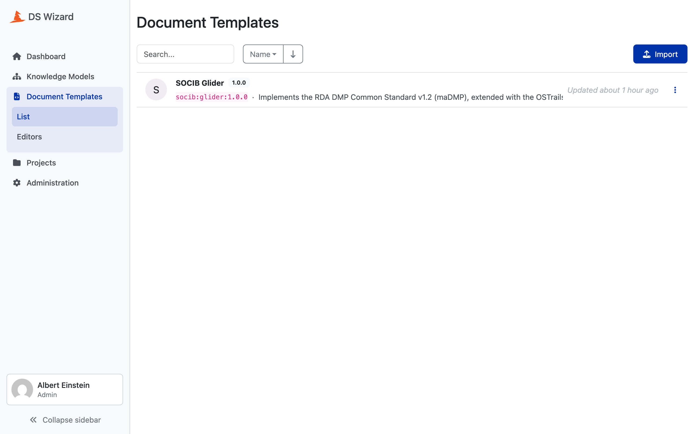

# Generating the document template

`dsw/generate_template.py` walks the **same** merged model as the Knowledge
Model generator and emits a DSW Document Template: a Jinja2 template that turns
a project's replies into a maDMP JSON document.

```bash
uv run python scripts/validate_generation.py   # writes build/template/...
```

## Two metamodel versions, not one

```python
TEMPLATE_METAMODEL_VERSION = "18.0"
```

A separate concept from the Knowledge Model's own `metamodelVersion` of 20.
Both are tied to the DSW instance and not to the project, and both have to be
checked when DSW is upgraded.

## The output

One JSON document with two top-level keys.

```json
{
  "dmp": { ... },
  "metadata": {
    "project": "glider",
    "template_version": "1.0.0",
    "rules": [{ "rda_dcs": "1.0.0" }, { "ostrails": "1.0.0" }]
  }
}
```

`metadata` names the versions the document was built from. It is what the
webhook reads to know which rules to judge the plan against, and it is
committed beside the plan as its provenance. See
[madmp-registry → The three files](../registry/02-files.md).

## Never write a UUID by hand here

Every question UUID the template references comes from `dsw.uuids`, applied to
the same model `generate_km.py` walks.

!!! danger "Two rules, and they are not style"
    Never write a UUID literal in this module, and never copy one out of a
    published Knowledge Model. Both work the day they are done and both break
    silently the day a field moves, because the KM will have moved with it and
    the template will not.

That is the entire reason [the UUID convention](05-uuids.md) exists: two
generators that never speak agree on every identity.

## The Jinja conventions

Four macros over `r = ctx.project.replies`, on top of DSW's own `reply_path`,
`reply_str_value` and `reply_items` filters.

| Macro | What it does |
|---|---|
| `sv(path)` | the raw string value of a reply |
| `av(path, default)` | the raw answer label of an options reply |
| `js(text)` | escapes a string for the inside of a JSON string |
| `jv(path)` | `js` applied to a reply, the one to use for output |

**`sv` and `av` are raw readers.** They exist for comparisons that need the
value itself, and are never used for output. A vocabulary label read through
`av` is wrapped in `js()` at the point it is emitted:

```jinja
"{{ js(AL.get(item_uuid, 'unknown')) }}"
```

!!! warning "js() is the whole of the escaping"
    The document is assembled as literal JSON text, not built as a Python
    object and serialised. So `js()` is the only thing standing between a
    researcher's reply and the file. A quote, a backslash or a newline typed
    into an answer reaches the document through it and nowhere else.

## Every key carries its comma in front

A generated JSON object cannot know in advance which of its keys will be
present, and JSON does not allow a trailing comma. The solution is uniform:

- every key is emitted with its comma **before** it
- every optional key sits in its own `` block
- the object's body is captured, and its first comma stripped at render time

So no key has to be unconditional, and adding an optional field never requires
finding out which key currently happens to be first.

## Computed fields

Some top-level fields are never asked. Their value comes from the render
context:

```python
COMPUTED_FIELD_EXPR: dict[str, str] = {
    "created": "ctx.project.createdAt",
    "modified": "ctx.project.updatedAt",
}
```

Those two are switched on by `auto_timestamps: true` in the project config
(see [3. configs/](03-configs.md)). `field_kind()` returns `computed` for them,
so the Knowledge Model emits **no question** and the template fills them from
the project's own dates. The two sides agree because they read the same
`computed_fields_from_config()`.

A computed field with no expression in that map is simply absent from the
document, which matches the KM emitting no question for it.

### dmp_id is computed too, and differently

`dmp_id` is always computed, whatever the config says.
`_dsw_dmp_id_field()` sets it to the DSW project's own URL:

```json
"dmp_id": {
  "identifier": "http://localhost:8080/wizard/projects/e225368b-...",
  "type": "url"
}
```

That is a **placeholder**. A plan's identifier should be where the plan lives,
and while it is still a draft in DSW, that is where it lives. The webhook
rewrites it to the registry's raw URL at the moment it commits, which is the
first moment a permanent address exists. See
[10. submission/](10-submission.md).

## An empty answer is an empty string

The template emits every required scalar unconditionally, so an unanswered
required question renders as `""`. That is deliberate, and the quality control
is built to match: it reads an empty string as an **absence**, not as a value.

```
"ethical_issues_exist": ""
```

Without that pairing, a required field nobody answered would pass both its
presence check and its type check. A string of spaces, on the other hand, stays
a value: that is content someone typed. The reasoning is in
[9. quality_control/](09-quality-control.md).

### A boolean has no empty string, so it renders null

A scalar says "supplied, empty" with `""`. A boolean has no such value, and it
used to say `false`.

!!! danger "false is not a silence, it is an answer"
    "Nobody answered" and "the answer is no" produced the same document, on
    fields like `is_reused` where the two statements have nothing to do with
    each other.

Three states, so three values: `true`, `false`, and `null` for unanswered. The
quality control reads `null` the way it reads `""`, as an absence, and the key
is still emitted, because it is the key that says the field is missing.

The price is accepted rather than hidden: `null` is not a valid boolean under a
standard's own schema. But `""` does not satisfy a required title either, and it
is the same doctrine that accepts it. Between a document that is **provably
incomplete** and a document that calmly asserts something nobody said, take the
first.

!!! note "Fixed before it was reachable"
    No standard on disk declares a required boolean: `dmp.dataset[].is_reused`
    is `0..1`. But `0..1 → 1` is a **tightening the merge allows**, so an
    extension could have switched this on without a line of code and without
    anything going red.

## Formats

`FORMATS` is one list describing every output format the template knows of,
implemented or not. It feeds two things at once: the bundle's `formats`, where
only entries marked `available` become a real DSW format, and the README's
table, where the others are visible as not yet implemented.

Today one format is available, `maDMP JSON (glider)`, whose UUID comes from
`format_uuid()` and which is the format the submission service is published
against.


