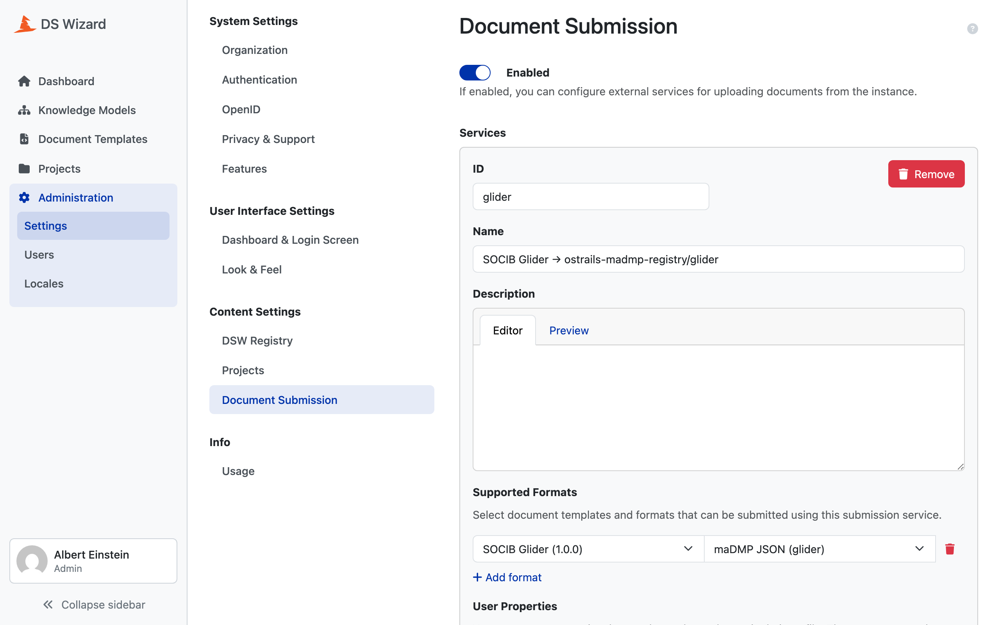

# Publishing to DSW

`dsw/publish.py` pushes what the generators wrote under `build/` into a DS
Wizard instance. **It builds nothing.** Run the generators first.

```bash
export DSW_API_URL=http://localhost:3000/wizard-api
export DSW_EMAIL=you@example.com DSW_PASSWORD=...
uv run python -m dsw.publish all configs/projects/glider.yaml
```

## Three targets, three different things

| Target | What it does | Endpoint |
|---|---|---|
| `km` | uploads the Knowledge Model bundle | `POST /knowledge-model-packages/bundle` |
| `template` | uploads the Document Template bundle | `POST /document-templates/bundle` |
| `submission` | declares this project's submission service | `PUT /tenants/current/config` |

The first two publish a **package**. The third edits the **instance**. That
distinction decides everything about how each behaves.

## all runs them in that order, and the order is load-bearing

```bash
uv run python -m dsw.publish all configs/projects/glider.yaml
```

`submission` needs the UUID of the document template that was just published,
so it cannot run before `template`. It also refuses to advertise a route to a
registry folder that does not exist, which is `_require_registered()`'s job
and the reason [11. registry/](11-registry.md) runs earlier in CI.

## Packages: idempotent through the version

A Knowledge Model and a document template are DSW packages: an identity, a
version, immutable. So publishing is idempotent **through the version**. An
already-published `package_id` is skipped rather than rejected, and bumping the
config's `version` is what publishes a change.

That is why every project can be offered on every run:

```bash
for cfg in configs/projects/*.yaml; do
  uv run python -m dsw.publish all "$cfg"
done
```

Nothing happens except where a version moved.

## The check that publishing cannot undo

```python
def _artifact(path: Path, generator: str, pid: str) -> Path:
    """One generated bundle, checked to be the one this config asks for."""
```

A bundle names its own package id, but the file it sits in does not carry a
version. So a config whose `version` was bumped **without regenerating** leaves
the previous bundle exactly where the new one would be.

Nothing downstream catches that. The listing is asked about the new id, answers
"not published", and the old bundle goes up under a version it was not built
with. Publishing is the one step with no undo, so the bundle's declared id is
confronted with the config's before a single byte is uploaded.

## The submission service is an upsert, and a whole-config write

A submission service is an entry in the tenant's configuration: mutable, keyed
by id, sitting beside other projects' entries.

**The API has no endpoint for one service.** Writing one means sending the
tenant's entire configuration back, so anything a human changed in the console
between the read and the write is silently reverted.

Two defences:

```python
unchanged = current is not None and installed_service(current) == service
if unchanged and submission.get("enabled"):
    print(f"Submission service {folder!r} unchanged (template {template_uuid}).")
    return
```

**A run that changes nothing writes nothing**, so it cannot revert anything
either. And the comparison is made over **what a write carries**, not over what
a read gives back, because the instance returns a service richer than the one
it accepts. Comparing the two shapes directly would report a difference on
every run and write on every run.

Other projects' services are left untouched: the list is rebuilt as "everything
that is not this id, plus this id".



## What the service points at

One webhook serves every project. The service scopes it two ways:

- `?project=<id>` on the URL, which tells the webhook which registry folder to
  write to
- the project's own document template UUID in `supportedFormats`, so only that
  project's documents can be submitted to it

```
http://submission:8080/submissions?project=glider
```

!!! warning "That address is right for one deployment and wrong for every other"
    `SUBMISSION_URL` is the webhook's address **as DSW reaches it**. In the
    deployment described in [madmp-dsw](../dsw/01-stack.md), the webhook
    runs beside DSW on the same compose network, so it is a service name and
    not a public address. Nothing in the code can tell a right one from a
    wrong one, and a wrong one fails at submission time, not at publish time.

## Configuration

Every coordinate comes from the environment, and **none has a default**.

| Variable | Needed by | What it is |
|---|---|---|
| `DSW_API_URL` | all | which instance |
| `DSW_EMAIL`, `DSW_PASSWORD` | all | as whom |
| `SUBMISSION_URL` | `submission` | the webhook's address as DSW reaches it |
| `SUBMISSION_TOKEN` | `submission` | the shared secret the webhook checks |
| `REGISTRY_OWNER`, `REGISTRY_REPO` | `submission` | which registry to check the folder in |

Asking for a value with no default means a missing one fails loudly at startup
instead of publishing to somewhere plausible.

## In CI

The `publish` job is conditional:

```yaml
if: vars.DSW_API_URL != ''
```

No variable, no publishing. A GitHub runner cannot reach an instance bound to
`127.0.0.1`, so a locally-run stack is published to by hand, from a developer's
own environment, exactly as above.
