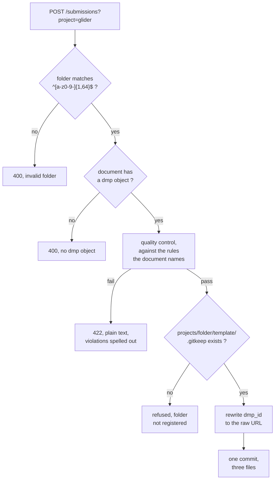
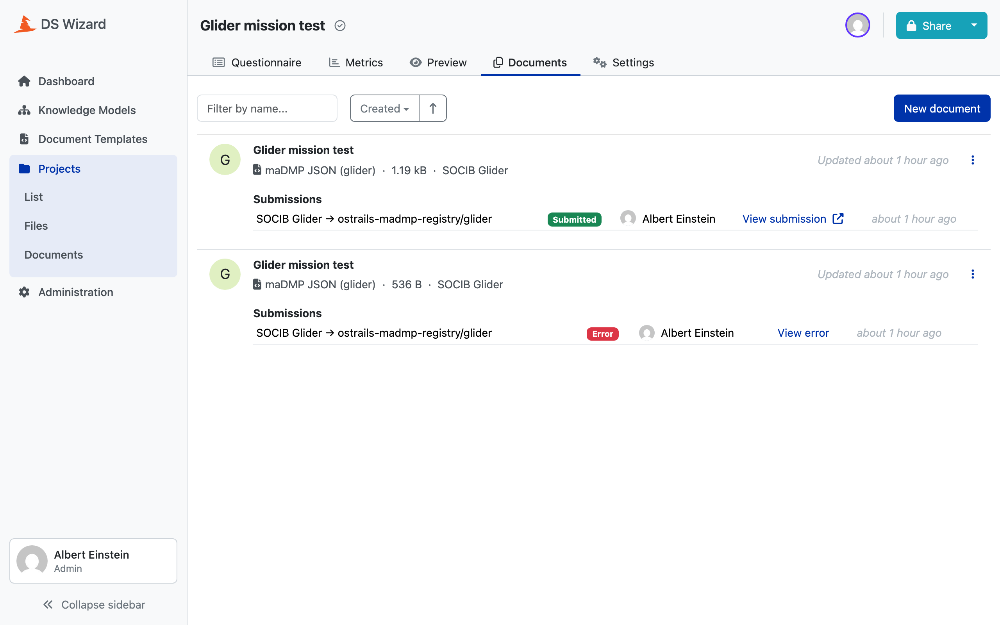

# submission/ : the webhook

DS Wizard posts a rendered document here. The webhook checks it against the
rules its own provenance names, and commits it to the registry only if it
holds up.

Two modules, deliberately: `service.py` is the logic, free of HTTP plumbing,
and `app.py` is the FastAPI wiring. It is stateless. Everything derives from
the document, the folder and a small static config.

## The route

```
POST /submissions?project=<folder>
Authorization: Bearer <SUBMISSION_TOKEN>
```

The folder comes from the query string of the Submission Service's URL, which
[8. Publishing to DSW](08-publish.md) put there. A raw JSON body and a
multipart upload are both accepted, because DSW sends either depending on how
the service is configured.

`GET /health` answers `{"status":"ok"}`, which is what the container's
healthcheck calls.

## Four variables, read once at startup

```python
REQUIRED = ("SUBMISSION_TOKEN", "REGISTRY_TOKEN", "REGISTRY_OWNER", "REGISTRY_REPO")
```

All four required, none defaulted, and **all four reported together** so a
fresh deployment is fixed in one pass rather than one restart per variable.

!!! warning "Missing and empty are the same failure"
    Compose always defines what its `environment:` block lists, so a value
    absent from `.env` arrives as an **empty string**, not as an absent name. A
    default written in this module would therefore never apply, and would read
    as a guarantee it could not keep. The values' one home is `.env.example`.

!!! danger "REGISTRY_TOKEN, not GITHUB_TOKEN"
    Compose lets the shell override `.env`, and `GITHUB_TOKEN` is a name a
    developer's shell often already holds. Naming it that way would have the
    webhook commit with someone else's credentials, in silence.

The token is compared with `hmac.compare_digest`, not `==`.

## The order of operations



**The quality control runs first**, before anything is read from GitHub or
written to it. It needs no network, and it is the answer the researcher is most
likely waiting for.

## The folder must already exist

```python
if github.get_file(owner, repo, f"{base}/template/.gitkeep") is None:
    raise SubmissionError(
        f"{base}/ is not initialized in {repo}, or not visible with this "
        f"token. Register the project first."
    )
```

Nothing here creates a repository or any scaffolding. The folder is laid out
beforehand, by [11. registry/](11-registry.md), running from CI. Dropping a DMP
into a folder nobody registered would leave a half-folder, so the webhook
refuses instead of creating one.

The error names both possible causes, because a token without visibility looks
exactly like a folder that is not there.

## dmp_id is rewritten here

```python
raw_url = f"https://raw.githubusercontent.com/{owner}/{repo}/{_BRANCH}/{dmp_path}"
document["dmp"]["dmp_id"] = {"identifier": raw_url, "type": "url"}
```

The template set `dmp_id` to the DSW project URL as a placeholder. The registry
location is the DMP's real identifier, and this is the first moment it exists.

!!! danger "The branch is part of every identifier ever issued"
    ```python
    _BRANCH = "main"
    ```
    Moving the registry to another branch would leave every `dmp_id` this
    webhook has ever written pointing nowhere.

## Three files, one commit

```python
wanted = {
    dmp_path:   _bytes(document),
    meta_path:  _bytes(provenance),
    check_path: _bytes(qc),
}
```

They go in a single commit, so **nothing ever holds a DMP without the versions
it was checked against or the verdict it got**. `commit_files()` uses the Git
Data API: four calls, only the last of which writes.

The whole operation is idempotent. The three wanted files are compared with
what is there, and a submission that says what the registry already says
commits nothing:

```python
if current == wanted:
    action = "unchanged"
```

That is why the envelope carries no timestamp: one would change the bytes on
every check and make `unchanged` unreachable.

The commit message is named after the folder, `Add DMP for glider (DSW
submission)`, because every project commits into the same repository and
`git log` shows the message before the path.

## What the researcher is told

A refusal is **plain text, not JSON**, because DSW shows the response body to
the researcher on a failure.

```
Quality control failed against rda_dcs 1.0.0, ostrails 1.0.0.

20 violation(s) to fix
  - ...
  ...

3 warning(s), which do not block
  - ...

76 checks passed, 30 optional fields left empty.
```

Violations first, because they are the only thing to act on. Warnings after,
labelled as not blocking, so a reader does not go hunting for a problem that
is not one.

!!! note "Twenty, then a count"
    ```python
    _SPELLED_OUT = 20
    ```
    DSW shows this on the submission itself, not in a report, so a document
    missing forty fields would push the beginning of the message out of sight.
    The count sits **above** the list, so a truncated list never passes for the
    whole of it.

On success, the response carries a line too, and the docstring is honest about
why it may never be read:

> DSW renders none of this. Its client shows a submitted document as a badge
> and a link to the `Location` header, and reads the response body only on a
> failure. The line is written and carried anyway, for whatever else reads a
> submission, and so the day DSW does show it there is nothing to write.



## Two error kinds, told apart on purpose

| Exception | Means | Response |
|---|---|---|
| `SubmissionError` | the submission cannot be routed | 400 |
| `QualityControlError` | the document does not hold up | 422, plain text |

The second is the one thing the researcher can fix, and the only one worth
spelling out to them.

## The folder slug

```python
_FOLDER_RE = re.compile(r"^[a-z0-9-]{1,64}$")
```

No dots, no slashes. A submission can never escape `projects/<folder>/` or name
anything but a folder. It is the same character set the project config's `id`
must match, which is not a coincidence: the folder **is** the project id.
