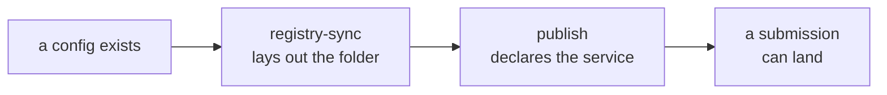

# registry/ and scripts/

Two small packages that write outside this repository, and the validators CI
runs against everything inside it.

## registry/ : laying out a folder

A folder that is not laid out is a folder a submission cannot land in. This is
the step that makes a project submittable, and it needs no DSW instance and
nothing generated: **a valid config is enough**.

### Two verbs, and only one of them writes

| Verb | Does |
|---|---|
| `folder_status()` | only ever reads, and answers whether the destination is laid out |
| `converge()` | writes, and is the act of registering |

A folder is its two subdirectories, and both verbs read both.

```python
SUBDIRS = ("template", "productions")
```

`template/` holds the submitted DMP, `productions/` the deployment DMPs derived
from it. Git stores no empty directory, so each is created holding a
`.gitkeep`.

### Three states

| State | Means |
|---|---|
| `registered` | both subdirectories are laid out |
| `stale` | one of the two is not |
| `missing` | neither is, so there is no folder at all |

`stale` exists because a folder half laid out is not the same problem as no
folder, and the message says which half.

### Converging

```python
absent = _absent_subdirs(gh, registry, config)
for subdir in absent:
    gh.create_file(...)
if not absent:
    return "unchanged"
return "created" if len(absent) == len(SUBDIRS) else "updated"
```

**Writes the `.gitkeep` files that are absent and nothing else.** Never
deletes, and never writes outside this project's own folder. The verb it
returns says what it actually sent, so a run that changed nothing says so.

That is what makes `scripts/sync_registry.py` safe to run on every push: a push
that touched no config leaves no commit behind.

### The contract with the webhook

The webhook checks for `projects/<folder>/template/.gitkeep` and refuses a
submission when it is not there. So the ordering across the whole pipeline is:



`publish submission` refuses to advertise a route to a folder that does not
exist, and the webhook refuses to write into one. Both read the same
`.gitkeep`.

## scripts/ : one validator per kind of data

| Script | Answers |
|---|---|
| `validate_rules.py` | does every rules file load and validate |
| `validate_configs.py` | does every project config load and validate |
| `validate_projects.py` | does every config's pins resolve, and do its rules merge |
| `validate_generation.py` | can every project generate its KM and its template |
| `validate_registry.py` | is every project's registry folder laid out (read only) |
| `sync_registry.py` | lay out every project's folder (writes) |

Each is a CI job of the same name, and each offers **every** file of its kind
rather than a list held somewhere. Adding a project config is enough for all
six to cover it.

### The two that do more than validate

`validate_generation.py` is a verdict and an artifact at once. It is the only
place every config goes through the generators, so it is what says the
repository can generate all of its projects and not just the one the tests
cover deeply. What it writes under `build/` is what a reviewer reads to see
what a rules change did to the questionnaire, and what `publish` ships.

It checks two things only a project's own vocabularies can answer: that the KM
emits no entity twice, and that the document template is Jinja at all. Both
would otherwise be answered by DSW, the first by silently dropping a question
and the second at render time.

`validate_registry.py` reads and never writes, so it can run on a pull request
from a fork without a token that can commit.

## utils/

Three modules the rest imports.

| Module | Holds |
|---|---|
| `utils/schema.py` | loading a JSON schema, and turning validation errors into a flat list of problems |
| `utils/errors.py` | `ProblemsError`, the base for every error that carries many problems at once |
| `utils/github.py` | the one GitHub client |

`ProblemsError` is why every loader in this repository reports **every**
problem it found rather than the first: it is a base class that holds a list
and a noun, and the loaders build the list before raising once.

### One GitHub client, and what it will not do

`utils/github.py` was two clients until they were merged. It exposes what this
project actually needs and nothing more:

| Method | Used by |
|---|---|
| `get_file()` | the webhook, `registry/` |
| `create_file()` | `registry/`, for `.gitkeep` |
| `branch_head()` | the webhook |
| `commit_files()` | the webhook |

!!! danger "A GitHub 404 means \"file absent\" only on a read"
    On a **write**, a 404 means the repository or the token's access is wrong.
    GitHub answers 404 rather than 403 so as not to confirm that a private
    repository exists, and it must never pass for a success.

    That is the one asymmetry of the transport, and it is tested in both
    directions.

The transport stops there. It returns and takes **bytes**: base64 and status
codes are its business alone, which is why no module that means anything
imports `base64`. The webhook still did before the two clients were merged, to
decode what its read handed back raw, and that was the transport's encoding
leaking into a module of meaning.

!!! warning "create_file() is a creation and not a replacement"
    ```python
    """(!!) A creation, and not a replacement. No ``sha`` is sent, so GitHub
    refuses with a 422 when the file is already there rather than
    overwriting it."""
    ```
    That is the right behaviour for a `.gitkeep`, which should never be
    rewritten. Writing a file that may already exist is `commit_files()`'s job,
    and it is what the webhook uses for the three files of a submission.
