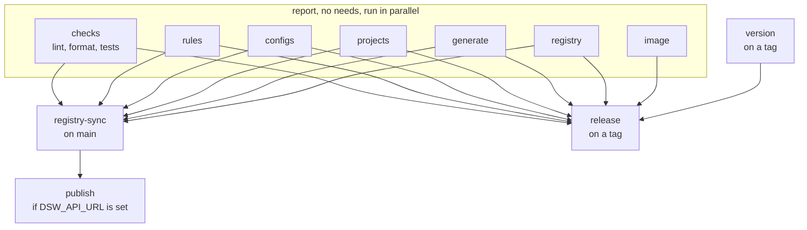

# Tests, tooling and CI

Eleven jobs. Six report on what the repository holds, three act outside it,
and two guard a tag.

## The job graph



**Only three jobs have `needs:`**, and they are the three that act:
`registry-sync` writes into another repository, `publish` writes into a DSW
instance, `release` publishes an image. Everything that only reports runs in
parallel and reports independently.

!!! note "Why `projects` and `registry` have no needs"
    A project that does not resolve is a broken project whether or not the
    lint passed. Making a reporting job wait on another only delays the
    report, and hides a second problem behind the first.

    Same for `image`: a Dockerfile that does not build is broken whether or
    not a rules file changed.

## The six that report

| Job | Runs |
|---|---|
| `checks` | ruff lint, ruff format, pytest |
| `rules` | `scripts/validate_rules.py` |
| `configs` | `scripts/validate_configs.py` |
| `projects` | `scripts/validate_projects.py` |
| `generate` | `scripts/validate_generation.py`, and uploads `build/` as an artifact |
| `registry` | `scripts/validate_registry.py`, read only |

Four of them write a step summary with `if: always()`, so what a project
resolved to, what it generated and what the registry looked like are readable
on a failed run too, which is when they matter.

`generate` uploads its `build/` as the `dsw-artifacts` artifact, with
`if-no-files-found: error` and a 14 day retention. That is what `publish`
downloads, so the thing published is the thing that was checked, not a rebuild.

## The two that guard a tag

`version` refuses a tag that lies, and it publishes nothing.

```yaml
if: startsWith(github.ref, 'refs/tags/v')
```

**The tag and the package version must agree.** The version lives in
`pyproject.toml` and nowhere else: it is what `importlib.metadata` hands the
webhook, which writes it into every verdict it commits. A tag disagreeing with
it would put a version in the registry naming a release nobody can check out.

**The tag must sit on the default branch.** A tag can be cut anywhere, and one
cut off `main` would publish an image built from code that was never merged,
under a version the repository's history does not explain.

```bash
git fetch --no-tags origin "+refs/heads/$DEFAULT:refs/remotes/origin/$DEFAULT"
if ! git merge-base --is-ancestor "$GITHUB_SHA" "refs/remotes/origin/$DEFAULT"; then
  echo "::error::$GITHUB_REF_NAME is not on $DEFAULT, it names code that was never merged"
  exit 1
fi
```

That check reads history the tag is not the tip of, so the checkout uses
`fetch-depth: 0`. A shallow clone carries none of it.

!!! warning "Why version is a job and not its own workflow"
    As a workflow of its own it could only ever turn red **beside** a publish
    that had already happened. Two workflows on one tag push run with no order
    between them, and GitHub Actions has no `needs:` across workflows. So it is
    a job of this workflow, and it sits in `release`'s `needs:`.

## The three that act

`registry-sync` runs on `main` only, and lays out every project's folder.

`publish` runs only when `vars.DSW_API_URL` is set, and pushes the KM, the
template and the submission service into an instance.

`release` runs on a tag and publishes
`ghcr.io/pstcricq/ostrails-madmp-core/submission:<tag>`.

!!! danger "A tag, never `latest`, and never a branch"
    An image tag that moved would leave two deployments running different code
    while reporting the same version, and the verdict committed beside every
    DMP says which version judged it.

`release` builds a second time rather than loading what `image` built. The
layers are in the cache by then, so it costs seconds, and passing an image
between jobs would be the same bytes with one more step to forget.

## The image

Two stages, and `uv sync --frozen`, so it is reproducible.

```dockerfile
FROM python:3.12-slim AS build
RUN uv sync --frozen --no-dev --extra submission --no-install-project
RUN uv sync --frozen --no-dev --extra submission --no-editable

FROM python:3.12-slim
RUN useradd --system --no-create-home webhook
USER webhook
CMD ["/venv/bin/uvicorn", "submission.app:app", "--host", "0.0.0.0", "--port", "8080"]
```

The dependency layer is installed before the project (`--no-install-project`),
so a code change does not reinstall the dependency tree. The runtime stage
carries the virtualenv and the source, no build tools, and runs as a system
user that owns nothing.

The `image` job does more than build it: it **starts the container and makes
two requests**, so a build that produces an image which cannot boot fails in
CI rather than in a deployment. It builds for `amd64` only, because that is
what a CI runner is and a second architecture doubles the time without
answering a different question. `release` is where both architectures are
built.

## Permissions, and pinned actions

```yaml
permissions:
  contents: read
```

Read-only at the top of the file, inherited by every job. Only `release` asks
for more, and it says so itself. Nothing can write to this repository by
holding a token it was handed without asking.

!!! warning "setup-uv is pinned to an exact version"
    ```yaml
    - uses: astral-sh/setup-uv@v10.0.1
    ```
    The moving major tags stopped existing after v8, so `@v10` is not a thing
    that resolves. Every action is also on a Node 20 or later runtime, which
    the runner now requires.

## Concurrency

```yaml
concurrency:
  group: ${{ github.workflow }}-${{ github.ref }}
  cancel-in-progress: false
```

One run at a time per ref, and **queued rather than cancelled**. Two pushes in
quick succession would otherwise have two `registry-sync` jobs laying out the
same folder, the second creating a file the first has just created, GitHub
answering 422, and the job going red having done nothing wrong.

Cancelling would be worse than queueing here: the jobs that act are the last
ones, so a cancellation would kill the run that is about to register.

## Tests

One test module per module, `tests/test_<package>_<module>.py`, run by `checks`
with the rest. They hold the derived UUID values, so a change to
`dsw/uuids.py` fails immediately rather than at publication time.

## Cutting a release

1. bump `version` in `pyproject.toml`
2. merge to `main`, and let CI go green
3. tag it and push the tag

```bash
git tag -a v1.0.0 -m "First complete version"
```

```bash
git push origin v1.0.0
```

`version` checks the tag against `pyproject.toml` and against `main`, then
`release` builds and pushes the image for `amd64` and `arm64`. A deployment
picks it up by naming that tag in its own `.env`.
