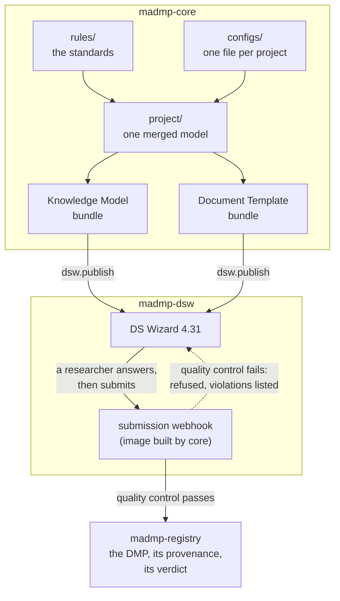

# At a glance

Three repositories turn a set of rules into a machine-actionable Data
Management Plan that a researcher fills in a web questionnaire and that ends up
committed, checked, in a git repository.

| Repository | What it owns |
|---|---|
| [`madmp-core`](https://github.com/pstcricq/ostrails-madmp-core) | The rules, the generators, the quality control, and the webhook that receives a submission. Everything that decides anything. |
| [`madmp-dsw`](https://github.com/pstcricq/ostrails-madmp-dsw) | A Data Stewardship Wizard deployment, and the webhook running beside it. Six containers and a `.env`. |
| [`madmp-registry`](https://github.com/pstcricq/ostrails-madmp-registry) | Where the plans land. A data repository: no code, a file contract. |

## The chain

Everything the questionnaire asks, everything the plan may contain, and
everything the quality control accepts comes from the same rules files. There
is one place where a field is declared, and the questionnaire, the document and
the verdict are all derived from it. That is the whole design, and the rest is
consequence.

## What this site is

A **reference**. It says how each part works and what its contract is, one page
per part, grouped by repository in the tabs above. Read a page when you need to
change something or to understand what a program will do.

It is not a narrative, and it does not argue for the design. It documents the
result.

## Where to start

- New to the pipeline: **madmp-core → 1. Overview**, then follow the pages in
  order. They are arranged along the path a change travels.
- Deploying it: **madmp-dsw → 1. The stack**.
- Reading a plan someone else produced: **madmp-registry → 2. The three
  files**.
- Reproducing the whole thing end to end: **Annexes → 1. An end-to-end run**.

## Versions this describes

| | |
|---|---|
| `madmp-core` | 1.0.0 |
| Data Stewardship Wizard | 4.31 |
| Rules standards | `rda_dcs` 1.0.0, `ostrails` 1.0.0 |

## Licensing

| Repository | Holds | Licence |
|---|---|---|
| `madmp-core` | code | Apache-2.0 |
| `madmp-dsw` | code, derived from an MIT deployment example | Apache-2.0, upstream notice in `NOTICE` |
| `madmp-registry` | data | CC BY 4.0 |
| this site | code and prose | Apache-2.0 for the code, CC BY 4.0 for `docs/` |

Copyright 2026 Pierre St-Cricq dit Lompre (SOCIB), as part of the OSTrails
project. Attribution is required everywhere, and nothing carries a warranty.
