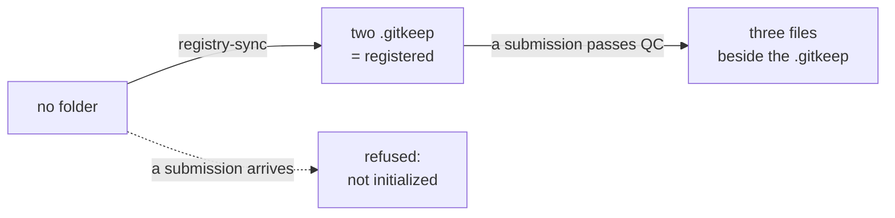

# The layout

`madmp-registry` holds data and nothing else. No code, no workflow, no CI.
Everything that produces what is here, and everything that judges it, is in
[madmp-core](../core/01-overview.md) and runs before the data arrives.

**Every file here is written by a machine, never by hand.** A researcher fills
in their DMP in DS Wizard and clicks Submit. Nobody needs a GitHub account to
appear here.

## The tree

```
projects/
  <id>/
    template/
      .gitkeep                        the mark that this project is registered
      dmp_<id>_template.json          the project DMP
      dmp_<id>_template.meta.json     the versions that DMP was built from
      dmp_<id>_template.check.json    the verdict it got against them
    productions/
      .gitkeep                        deployment DMPs, placeholders resolved
```

## `<id>` is one string, used four times

The project's one and only machine name. The same string names:

- the project's config in madmp-core, `configs/projects/<id>.yaml`
- this folder, `projects/<id>/`
- the DSW packages generated for it, `organizationId:<id>:version`
- the `?project=<id>` the submission service sends to the webhook

```
^[a-z0-9-]{1,64}$
```

`glider`, `canales`, `endurance-line`. **No dots and no slashes**, so nothing
can ever be written outside a project's own folder. The same expression is in
the config schema and in the webhook, which is not duplication for its own sake:
one validates what a human writes, the other validates what arrives over HTTP.

## What a registered project is, before it has a DMP

Two `.gitkeep` files. That is all.

Git stores no empty directory, so those two files are the whole of the mark.
A folder without them is a project nobody registered, and a submission to it is
**refused rather than half written**.



Laying them out is `scripts/sync_registry.py`, running from madmp-core's CI on
`main`. Its three states, and why a half-laid-out folder is its own state, are
in [madmp-core → registry/](../core/11-registry.md).

## Two subdirectories, two kinds of plan

### template/

The **project** DMP: one plan per project, with `{snake_case}` placeholders
where a value belongs to a deployment rather than to the project. This is what
a submission from DSW writes.

### productions/

The **deployment** DMPs, derived from the template with its placeholders
resolved. One glider mission, one production. Nothing writes here yet, and the
`.gitkeep` holds the place.

That distinction is the reason a folder has two subdirectories rather than one,
and the reason `folder_status()` reads both before calling a project
registered.

## Nothing here is repairable after the fact

The three files of a submission are always written together in a single commit.
A DMP whose versions or whose verdict were missing would be a DMP nobody can
check, and there is no code in this repository to repair one.

That is a deliberate property of the design rather than a rule people follow:
the webhook builds the three, compares all three, and commits all three or
none.
