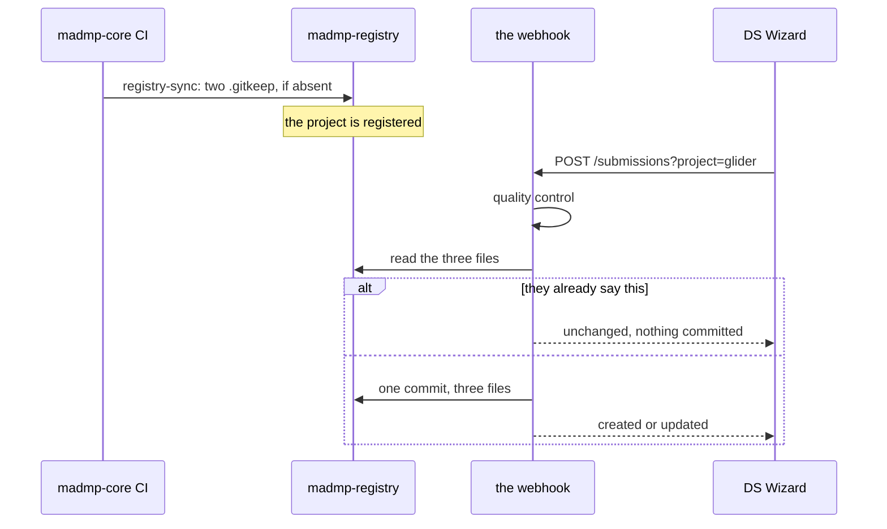

# Who writes what

Nothing in this repository writes anything. Two programs outside it do, each
with its own token, its own trigger and its own strictly bounded reach.

## The two writers

| | `sync_registry.py` | the submission webhook |
|---|---|---|
| Lives in | madmp-core, `scripts/` | madmp-core, `submission/`, running in madmp-dsw |
| Runs | in CI, on a push to `main` | on a POST from DS Wizard |
| Writes | `.gitkeep`, and only when absent | the three files of a submission |
| Method | `create_file()`, one call per file | `commit_files()`, one commit for three |
| Deletes | never | never |
| Reaches | one project's folder | one project's folder |



## Registering: create, never replace

```python
gh.create_file(
    registry.owner, registry.repo,
    keep_path(config, subdir), b"",
    f"register: {config['id']} {subdir}/",
)
```

`create_file()` sends no `sha`, so **GitHub refuses with a 422 when the file is
already there** rather than overwriting it. That is the right behaviour for a
`.gitkeep`, which should never be rewritten, and it means the job has to know
what is absent before it writes. It does: `_absent_subdirs()` reads first.

A commit here reads `register: glider template/`.

## Submitting: three files or none

The webhook builds all three, compares all three, and commits all three
together:

```python
wanted = {dmp_path: ..., meta_path: ..., check_path: ...}
current = {path: github.get_file(owner, repo, path) for path in wanted}

if current == wanted:
    action = "unchanged"
```

`commit_files()` uses the Git Data API, four calls of which only the last
writes, so there is no window where the registry holds a DMP without its
provenance or its verdict.

A commit here reads `Add DMP for glider (DSW submission)`, or `Update` when the
files were already there. Named after the folder, because every project commits
into the same repository and `git log` shows the message before the path.

## Idempotence is visible, not assumed

Both writers report what they actually sent.

| Reported | Means |
|---|---|
| `unchanged` | nothing was sent |
| `created` | the whole thing was absent |
| `updated` | part of it was |

A CI run on a push that touched no config leaves **no commit behind**, and a
re-submission of an unchanged plan leaves none either. That is what makes the
history of this repository readable: every commit corresponds to something
having actually changed.

The property that makes it work is that the verdict carries no timestamp. See
[2. The three files](02-files.md).

## The tokens

| Writer | Token | Permissions |
|---|---|---|
| `sync_registry.py` | `REGISTRY_TOKEN` in madmp-core's CI secrets | Contents RW, Metadata R |
| the webhook | `REGISTRY_TOKEN` in the deployment's `.env` | Contents RW, Metadata R |

Two different secrets with the same name in two different places, and they do
not have to be the same value. Fine-grained PATs, scoped to this repository
alone.

!!! danger "Not GITHUB_TOKEN"
    The webhook reads `REGISTRY_TOKEN`, deliberately. Compose lets the shell
    override `.env`, and `GITHUB_TOKEN` is a name a developer's shell often
    already holds, so that rename would have the webhook commit with someone
    else's credentials, in silence.

## What neither of them can do

- **create this repository**, or any scaffolding beyond a project's two
  subdirectories
- **delete** anything
- **write outside `projects/<id>/`**, which the `^[a-z0-9-]{1,64}$` slug
  guarantees: no dots, no slashes, no traversal
- **write a DMP into an unregistered folder**, which the webhook refuses rather
  than creating a half-folder

## Reading it back

Everything committed here is meant to be read by machine, starting with the
`dmp_id` itself:

```bash
curl https://raw.githubusercontent.com/pstcricq/ostrails-madmp-registry/main/projects/glider/template/dmp_glider_template.json
```

And re-judged, against the rules it names rather than against today's:

```bash
uv run python -m quality_control.run \
    --pins projects/glider/template/dmp_glider_template.meta.json \
    --dmp  projects/glider/template/dmp_glider_template.json
```
